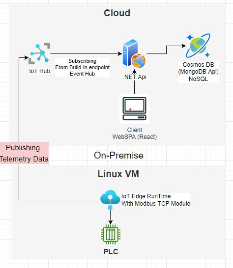
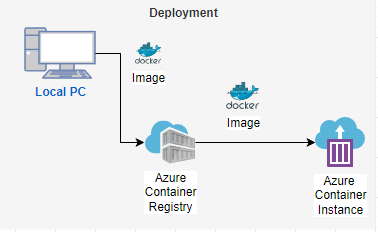

## <ins>Azure IoT Demo<ins>

### Architecture
  

1. IoT Edge Runtime running insde an Linux VM 
communicating with PLC using Modbus TCP module to retrieve telemetry data and publishing to IoT Hub
2. .NET retrieve any latest event & telemtry data from IoT hub 
 and push data to Cosmos DB
3. ClientApp to display latest data and historical data with 10 second interval

### <ins>Deployment<ins>
  
